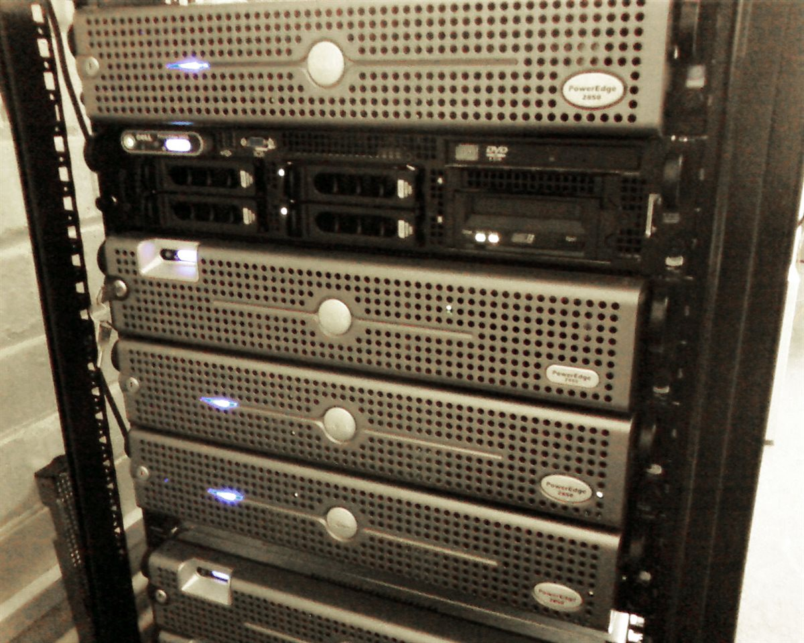
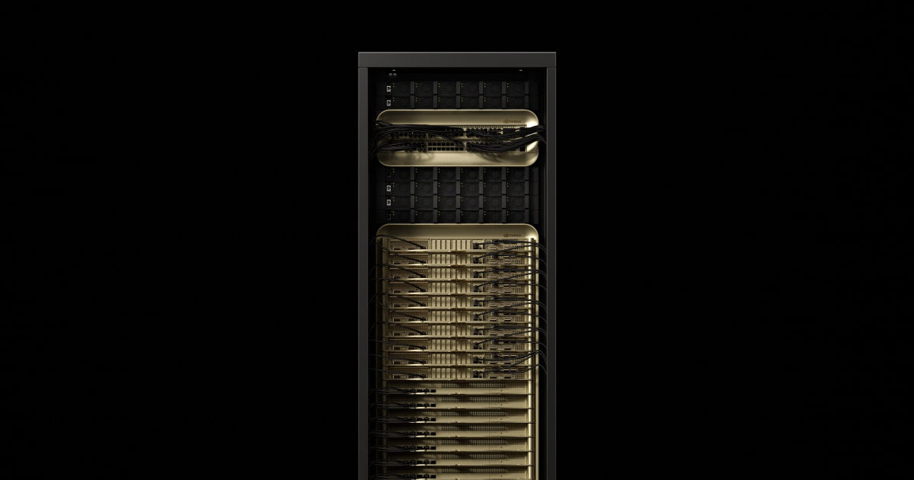
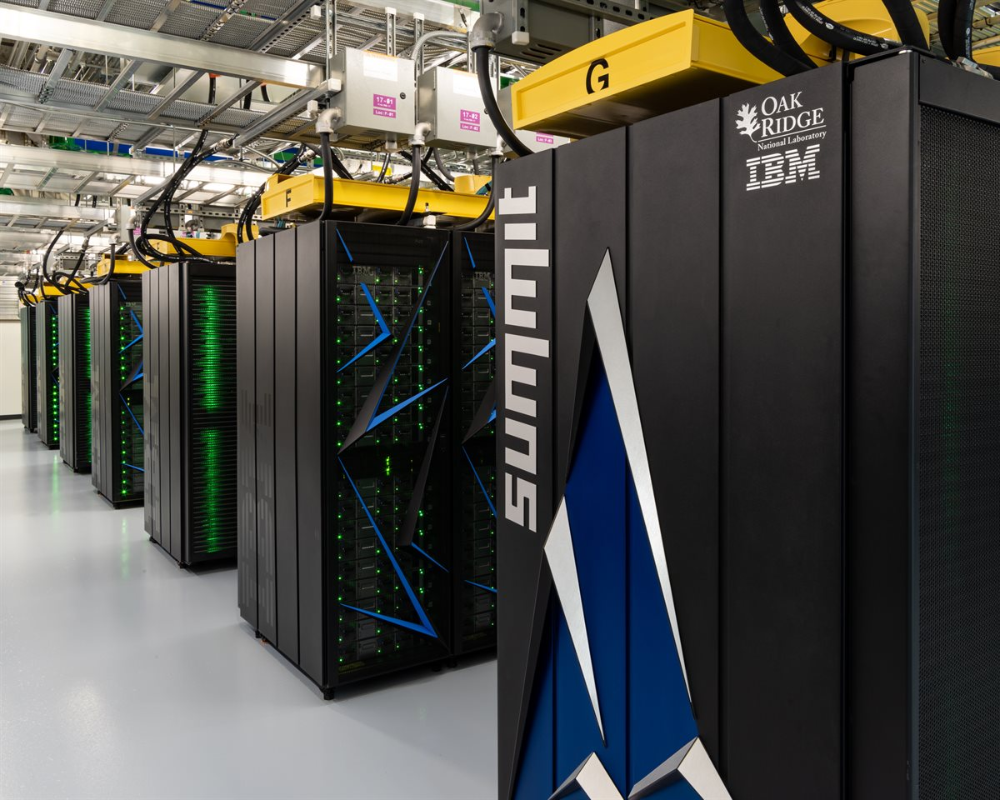

# 集群：把单卡扩成集群

> **这一层在讲什么。** 到这里，卡已经被框架用起来了（[L6](../L6-框架与模型/00-框架与模型.md)）。但一张卡的显存装不下大模型，一张卡的算力也训不动万亿参数——所以要把几十、几千张卡组织成一台"逻辑上的超级计算机"。这一层讲的就是这件事：**怎么把卡连起来、怎么切分工作、怎么让它们像一个整体一样工作**。
>
> **本文建立概念，不追求精确。** 想知道"这个集群到底多快、多贵、值不值"，看 [01-集群评测](01-集群评测.md)。
>
> **和上下层的关系。** 下面的 L1（芯片）决定单卡的上限，L2（可编程模型）决定卡能不能被高效驱动，L3/L4（驱动与运行时）决定主机这边的路径有多短；而这一层决定**单卡的上限还剩多少能叠加起来**。关键的耦合量是 [overview.md](../overview.md) 里那条「重叠率」：通信时间 ×(1 − 重叠率) 必须能被计算时间藏住，否则加卡就是白加。

---

## 一、为什么需要集群：三堵墙

单卡走到集群，不是因为"想要更多算力"这么简单，而是被三堵墙逼出来的：

| 墙 | 表现 | 因此必须做的事 |
|---|---|---|
| **容量墙** | 模型权重 + KV cache + 激活放不进一张卡的显存 | 把模型切开（张量并行、专家并行），或把请求切开（流水并行） |
| **算力墙** | 训练一个万亿参数模型，单卡要跑到天荒地老 | 数据并行把 batch 摊到多卡，缩短墙钟时间 |
| **带宽墙** | 每算一个 FLOP 要搬多少字节，HBM 带宽先到顶 | 用更快互联把中间结果留在高速域内 |

三堵墙对应三种并行策略，而**并行的代价就是通信**——这是 L7 全部工程问题的源头。

### 并行的四种切法

| 策略 | 切什么 | 通信量 | 主要解决 |
|---|---|---|---|
| 数据并行 DP | 切 batch，每卡一份完整模型 | 每步梯度 allreduce，通信量 ∝ 参数量 | 算力墙 |
| 张量并行 TP | 切单层的矩阵乘，层内多卡协作 | 每层都要 allreduce/allgather，**通信最频繁** | 容量墙 + 单层算力 |
| 流水并行 PP | 按层切成若干段，不同段在不同卡上 | 只在段边界传激活，但有"气泡"空闲 | 容量墙 |
| 专家并行 EP | MoE 的不同专家放不同卡 | 每 token 都要 all-to-all 路由 | 容量墙（MoE 专用） |

实际训练是这四种的混合（例如 TP=8 × PP=4 × DP=…），**组合方式直接决定通信开销，也决定扩展效率**——这就是为什么同一批卡、换一个并行配置，性能能差出一大截。

---

## 二、集群的四种硬件形态

同样是"一个集群"，交付单位可以从一台服务器一直到一整片机房。四种形态的差别不在规模，而在**耦合方式**：耦合越紧，域内带宽越高、通信税越低，但配电、制冷和采购门槛也越高。

| 形态 | 交付单位 | 单域规模 | 内存是否池化 | 冷却 | 典型方案 | 适合谁 |
|---|---|---|---|---|---|---|
| 传统单台服务器 | 台（1U/2U/4U） | 单机 8 卡以内 | 否 | 风冷为主 | HGX 8 卡服务器、各 OEM 通用机型 | 起步、小规模、预算敏感 |
| 超节点整机柜 | 柜 / 超节点 | 数十至数千张卡一个逻辑域 | 部分（柜内共享） | 液冷为主 | GB300 NVL72、CloudMatrix 384、Atlas 950 | 大 MoE 训练、长上下文推理 |
| 定制化集群 | 整套集群 | 一个机房 / 一栋楼 | 否（靠网络） | 液冷 + 机房级配电 | 超算交钥匙工程（如 Summit） | 政企、科研、国家级项目 |
| 机架 | 不是产品，是装法 | 42U 标准高度 | — | — | 所有形态最终都装进机架 | 理解“U”“整柜”的前提 |

### 机架：所有形态的物理底座

一个标准化的金属柜子，用来把多台服务器、网络设备、存储等集中装在一起。一台普通服务器可能是 1U、2U 或 4U 高，直接滑进机柜的导轨上。“U”是机架高度单位，1U = 4.445 厘米，标准机柜通常 42U。所以“整柜”这个词本身不带算力含义——它只是说“交付时已经装好了一柜子东西”，算力要靠卡数和单卡规格去算。

### 传统单台服务器：最基础的交付单位

按“台”买卖，适合预算有限或起步阶段的企业自己组网。机内通常是 8 卡、走 NVLink 或厂商私有互联（如 HCCS），出了机箱就得走以太网 / InfiniBand。好处是采购、扩容、替换都以台为单位，坏处是**跨机通信立刻变成瓶颈**——这也是整柜方案存在的理由。

*2U 机架式服务器的正面：一排 2U 机器装进标准机柜导轨，这就是“按台买”的物理单位。图片来源见文末。*

### 超节点整机柜：把几十上百张卡焊成一个逻辑域

比普通机架耦合更紧密，通过高速总线把几十上百张卡“焊”成一个逻辑上的超级计算机，追求极致的协同效率。判断一个方案是不是超节点，看三个数：**域内卡数、域内聚合带宽、池化后的内存总量**。

*GB300 NVL72：72 张 GPU + 36 张 CPU 在一个液冷柜里组成一个 NVLink 域，域内聚合带宽 130 TB/s、内存约 20 TB——这两个数才是超节点的卖点。图片来源见文末。*

### 定制化集群：卖的是交钥匙工程

不只是卖硬件，而是根据业务需求提供从设计、组网到调优的“交钥匙”工程，属于深度定制的系统交付。买家拿到的是一片能直接跑作业的机房，代价是周期长、绑定深、单价不透明。

*定制化集群的样子：机柜上方的黄色管路是液冷回路，整排机柜由厂商按机房条件定制供电与制冷。这类项目的报价和交期都不公开，只能从公开的超算榜单反推量级。图片来源见文末。*

---

## 三、这一层由哪些东西组成

把上面三堵墙和四种形态拆开看，L7 的技术栈其实是五块：

| 组成 | 解决什么 | 典型技术 |
|---|---|---|
| **集合通信** | 多卡之间怎么交换数据 | allreduce / allgather / reduce_scatter / alltoall；NCCL、HCCL |
| **互联与拓扑** | 数据走哪条路、多快 | 机内 NVLink / HCCS、机间 InfiniBand / RoCE、超节点统一总线；拓扑感知路由 |
| **并行策略** | 模型和 batch 怎么切开 | DP / TP / PP / EP 及其组合，通信量由此决定 |
| **调度与多租户** | 谁在什么时候用哪些卡 | 配额、抢占、故障域隔离、拓扑感知分配 |
| **容错与可观测** | 挂了怎么办、现在在干什么 | checkpoint / restart、MTTR、集群级监控 |

---

## 四、这一层的玩家

谁在提供"集群"，决定了你实际能买到什么形态：

**芯片原厂**（定义互联标准与参考架构）
- NVIDIA：GB200 NVL72、GB300 NVL72、HGX B300/H200 八卡平台、DGX SuperPOD；后续 Vera Rubin NVL144 路线。生态 CUDA + NVLink + NCCL，是大集群事实标准
- AMD：MI300X / MI325X / MI350 系列，Helios 机架级方案，ROCm 生态
- 华为昇腾：Atlas 800 训练/推理服务器、Atlas 900 集群、CloudMatrix 384 超节点（384 卡靠 UB/灵衢互联），生态 CANN + MindIE
- 其他国产芯片原厂：海光 DCU、寒武纪思元（MLU）、摩尔线程 MUSA、壁仞、天数智芯、沐曦

**OEM**（做整机/整柜交付，把芯片变成能进机房的产品）
- 戴尔 Dell：PowerEdge XE9680 / XE9712、IR7000 液冷机架，NVIDIA/AMD 双线
- HPE：Cray 超算线（XD670 等）、ProLiant DL380a、液冷 Compute 机架
- 联想 Lenovo：ThinkSystem SR680a V3、SR675 V3，Neptune 液冷
- 超微 Supermicro：8 卡 SYS-821GE、GB200/GB300 NVL72 整柜
- 台系代工/整机：广达 Quanta、鸿海 Foxconn、纬创 Wistron、技嘉 Gigabyte、华硕 ASUS、微星 MSI（大量云厂商集群的实际制造商）
- Intel Gaudi 3：有整机但生态份额在收缩
- 浪潮 Inspur：NF5688/NF5488 系列，NVIDIA 与国产卡双线
- 新华三 H3C：UniServer R 系列 GPU 机型
- 中科曙光 Sugon：XMachine、海光/寒武纪机型
- 宁畅 Nettrix：X660 系列，互联网大厂常用
- 中兴、华鲲振宇、宝德、长城：昇腾/国产化整机集成

**云厂商**（把集群切成可租用的实例，也常常自研整柜）
- 阿里云、腾讯云、华为云、AWS、Azure、GCP（TPU Pod）

---

## 五、这一层的战略问题

技术之外，L7 有三个绕不开的现实约束，它们常常直接决定选型：

1. **互联是生态锁定的地方。** 换卡容易，换掉一整套互联 + 通信库 + 拓扑调优很难。NVLink/NCCL 是事实标准，开放阵营（UALink、UEC、超以太网）在追。
2. **功耗与机房是硬门槛。** 整柜 120 kW 级方案需要液冷和配电改造，"买得起"和"装得下"是两件事。
3. **规模和效率不等价。** 卡越多，通信税越高、故障越频繁。**扩展效率曲线从哪掉头，就是这套集群的有效规模上限**——这个判断方法在 [01-集群评测](01-集群评测.md) 里给了实测数据。

---

## 延伸阅读

- [01-集群评测](01-集群评测.md) —— 这一层的指标、评测集与性能甜点（含实测图表）
- [overview.md](../overview.md) —— 全栈总目录与四组层间关系
- [L6-框架与模型](../L6-框架与模型/00-框架与模型.md) —— 上一层：模型怎么被用起来

**图片来源**：`assets/commons-dell-poweredge-2950.jpg`（摄影 Inspiredbymetal，Wikimedia Commons，公有领域）、`assets/commons-summit-supercomputer.jpg`（摄影 Carlos Jones/ORNL，Wikimedia Commons，CC BY 2.0）、`assets/nvidia-gb300-nvl72.jpg`（NVIDIA 官方产品图，版权归原厂，仅作学习引用）。
