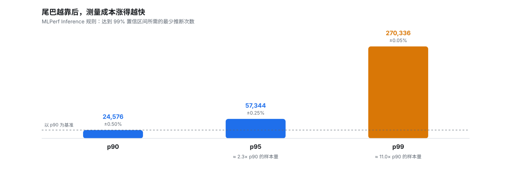
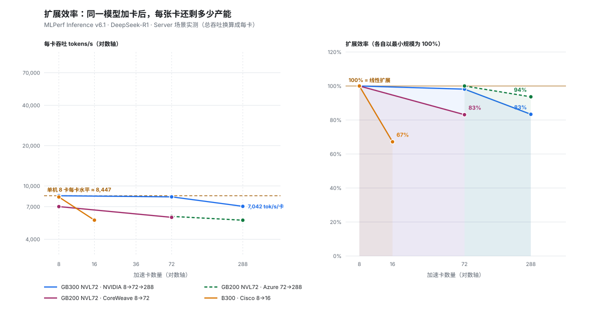
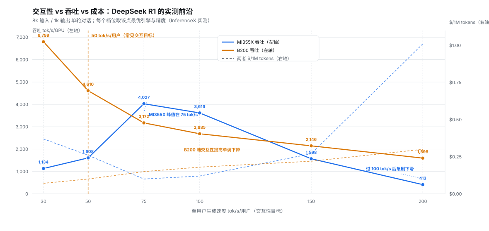

# 集群评测：指标、评测集与性能甜点

[00-product.md](00-product.md) 回答“市面上有什么、大概多少钱”，这篇回答**怎么判断一个集群好不好**。

先记住一句话：**集群没有单一分数，只有一条取舍曲线。** 任何人给你一个孤立的“吞吐 XX 万 token/s”，在没有标注延迟、模型、输入输出长度、精度和引擎版本之前，都不构成一个可比较的结论。

> 本文的原则：**方法写实数，榜单不写数字。** 场景定义、延迟约束这类规则来自官方规则文件（已核对，见文末来源）；具体版本与得分每季度都会变，请以官方结果页为准。

---

## 一、为什么集群评测特别难

七个变量各自都能让结果差出好几倍：

| 变量 | 影响 |
|---|---|
| 模型与结构 | MoE 与 dense 的瓶颈完全不同；MoE 吃通信，dense 吃算力 |
| 输入 / 输出长度 | 输入长度决定 prefill 成本，输出长度决定 decode 成本，比例一变结论就变 |
| 精度 | FP4 / FP8 / BF16 / INT8 之间是成倍的算力和带宽差异 |
| 并发与 batch | 大 batch 吞吐高但单用户变慢，见第六节“甜点” |
| 交互性目标 | 50 tok/s/用户 与 200 tok/s/用户 是两个完全不同的评测点 |
| 引擎与调度 | 连续批处理、chunked prefill、PD 分离、KV cache 策略都会改变曲线形状 |
| 集群规模 | 1 卡到 1000 卡不是线性放大，见第五节“扩展效率” |

**最要命的是第七项**：单卡跑分可以线性外推，集群不行。所以 L7 的结论必须带规模，写“8 卡”还是“整柜 72 卡”是两件事。

本文用到的量纲统一如下：

| 符号 | 含义 | 单位 |
|---|---|---|
| TTFT | Time To First Token，首 token 延迟 | ms |
| TPOT / ITL | Time Per Output Token / Inter-Token Latency，token 间延迟 | ms/token |
| tok/s/user | 单用户生成速度，= 1000 / TPOT | token/s |
| prefill | 处理输入、生成 KV cache 的阶段 | 算力受限 |
| decode | 逐 token 生成的阶段 | 访存受限 |
| RPS | Requests Per Second | 请求/s |

---

## 二、用户视角：延迟与 SLA

用户只感知两件事：**多久开始出字**（TTFT）和**出字多快多稳**（TPOT 及其抖动）。

- **TTFT** 由 prefill 决定，长输入、大 batch、chunked prefill 都会推高它；它也是排队时间的载体——**系统越忙，TTFT 涨得越快**，这是过载的第一信号。
- **TPOT / ITL** 由 decode 决定，理论上是个访存带宽问题：每生成一个 token 要把权重读一遍。所以 decode 的优化方向是提高 batch 把带宽摊薄，而不是提高算力。
- **端到端延迟** ≈ TTFT + 输出长度 × TPOT，报告时要把三项分开，混在一起什么都没法判断。

一个可执行的 SLA 通常长这样：

```
TTFT p99 < 2 s  且  TPOT p99 < 40 ms（≈25 tok/s/用户）  且  错误率 < 0.1%
```

### 2.1 先厘清三个词：SLA、SLO、SLI

| 词 | 全称 | 是什么 | 谁关心 |
|---|---|---|---|
| SLI | Service Level Indicator | **指标本身**：TTFT、TPOT、可用性、错误率 | 工程师 |
| SLO | Service Level Objective | **内部目标**：TTFT p99 < 2 s | 团队自己 |
| SLA | Service Level Agreement | **对外合同**：承诺提供什么服务、达到什么水平、**达不到怎么赔** | 客户与法务 |

SLA 必须包含三部分，缺一不可：

1. **服务范围**：哪些模型、多长上下文、什么精度、并发上限、排除条款（比如超长输入不算）。
2. **可测的性能承诺**：TTFT、TPOT、可用性、错误率——每一项都要能测、能复现、能举证。
3. **违约补偿**：赔多少、怎么算、怎么申请。

第 3 条是 SLA 与 SLO 的真正分界：**没有约束力的指标只是内部目标**。SLA 通常会留一点余量——对外承诺 p99，内部按 p90 报警，等真踩到 p99 再处理就已经违约了。

### 2.2 为什么看 p99，而不是平均值

先定义：**p99 表示 99% 的请求比这个值更快，1% 更慢**。它不是“最差情况”，而是“最差那 1% 的起点”。

平均值之所以不够用，是因为**用户的体感由尾部样本决定，而流式输出的误差会累积**：

- 假设 p99 是 1 秒，一个用户生成 100 个 token，就大约有 1 次撞上这 1 秒——**这一次卡顿会直接被他看见**。
- 而平均值不需要 99% 都快，只要 98% 的请求很快就能保持好看。**2% 的请求慢 10 倍，平均值几乎不动，用户却已经流失了。**
- 扩容水位也是按分位数定的：要压住 p99，你需要为最忙的那 1% 准备容量，而不是为“平均负载”准备容量。

**分位数越靠尾部，测量成本越高。** MLPerf 的官方表格很能说明问题（要求 99% 置信区间）：

| 尾巴分位 | 允许误差 | 需要的推断次数 |
|---|---|---|
| p90 | ±0.50% | 24,576 |
| p95 | ±0.25% | 57,344 |
| p99 | ±0.05% | 270,336 |

从 p90 到 p99，误差要求收紧一个数量级、样本量涨约 11 倍。这就是为什么“把 SLA 再往上提一档”往往不是工程调优，而是要重做一次评测。



*同样要把误差压住，p99 的样本量约是 p90 的 11 倍——这就是尾部承诺的隐藏价格。数据来自 MLPerf 官方规则附录（99% 置信区间）。*

> 口径提示：MLPerf 里 Server 与 Interactive **不是两个场景**，而是同一场景下的两种延迟约束档位，负载都是泊松到达。有些材料把它们并列成场景，容易让人误以为负载模式不同。

### 2.3 为什么“50 tok/s/用户”是常见交互目标

先把定义摆正：**tok/s/用户就是单个用户的生成速度，等于 1000 / TPOT**。同一个量有两种写法：

- 写成速度：**≥50 tok/s/用户**
- 写成延迟：**TPOT ≤ 20 ms**（1000 / 50）

它们是一回事，而不同的材料各用各的写法，这也是为什么看板时要多问一句“你说的是哪一头”。

它之所以被反复当作基准线，有三个理由：

1. **和人的阅读速度对齐。** 人的中文阅读速度量级在每分钟数百字，约合每秒 5～8 字；中文里 1 个 token 大约对应 1～2 个汉字。所以 50 tok/s 的生成速度（≈50～100 字/秒）已经远超人的阅读速度——此时瓶颈回到人身上，用户是在“读”，而不是在“等”。
2. **它落在曲线的中段，是个方便的比较锚点。** 在这个档位上，算力、显存带宽、并发能力三者的取舍还算均衡，便于横向比较；再往上（几百 tok/s）单位算力换来的体验提升迅速变差，成本却继续上升。
3. **它是买得起的档位。** 对服务方而言，交互性越低越容易摊薄成本。50 tok/s 是“用户不抱怨”与“账单能看”之间被反复验证过的中位数选择。

**但它不是普遍真理，三个反例必须知道：**

- **看使用场景。** 实时翻译、语音对话要求更高（低延迟比高吞吐重要）；离线批量生成、数据合成几乎不需要交互性，用 Offline 口径比就好。
- **看语言。** 逐字阅读的语言与逐词阅读的语言，对 tok/s 的诉求不同，跨语言比较要小心。
- **看是否有下游消费者。** 如果输出直接喂给程序而不是人，人眼可读速度就不再是约束，该看的是端到端作业完成时间。

最能说明“50 只是锚点”的证据来自官方规则本身——**MLPerf 给不同模型定的 TPOT 约束并不一致**：

| 基准模型 | Server 档 TPOT 约束 | 折算 tok/s/用户 |
|---|---|---|
| DeepSeek-R1 | 80 ms | ≈12 |
| Llama3.1-405B | 175 ms | ≈6 |
| Llama2-70b | 200 ms | 5 |

而同一批模型的 Interactive 档则收到 15～80 ms（≈12–67 tok/s/用户）。**同一份规则里差出一个数量级，说明“交互性目标”是逐工作负载定的，不存在统一标准。**

最后是一条必须记住的口径纪律：**“50 tok/s/用户”通常是中位数口径，不能当 p99 用。** p99 意义上的每用户速度会明显低于中位数——把中位数当尾部承诺，会系统性高估可卖容量（00-product.md 也标了这条，量级在 10–30%）。看到任何“50 tok/s/用户”的说法，先问一句：**这是中位数、均值，还是 p99？**

### 2.4 缩放成集群时还要注意什么

- **压缩会改写交互性。** 量化能降低每 token 的访存成本，从而同时改善 TPOT 和吞吐，所以“同一张卡不同精度”其实是两条曲线。
- **分词器变了，曲线也会平移。** token 与字符的换算比例随分词器而变，跨模型比 tok/s 要小心。
- **交互性目标与并行策略耦合。** 张量/专家并行把一次前向拆到多卡，能提高吞吐，但也可能增加每 token 的通信等待，从而抬高 TPOT。

### 2.5 落到 SLA 上的两个结论

1. **SLA 决定“能不能收这个钱”。** 满足 SLA 约束下的最大吞吐才是可卖容量，这就是 **goodput**（有效吞吐）与裸吞吐的区别——后者往往靠牺牲延迟换来的。
2. **约束要成对写。** TTFT 和 TPOT 必须一起出现：只承诺“出字快”而不限制“多久开始出字”，用户照样会走。

---

## 三、成本视角：$/百万 token 与 TCO

技术指标最终要换成钱才可比。常用的三个：

| 指标 | 定义 | 用来看什么 |
|---|---|---|
| $/卡·h | 单卡持有或租用成本 | 硬件本身的贵贱 |
| $/百万 token | 总成本 ÷ 期间产出的 token 数 | 真正在买的东西 |
| 有效吞吐 / (功耗 × 成本) | 分母是功耗和采购价的乘积 | 数据中心的终极口径 |

`$/百万 token` 的陷阱在于**分子分母都随负载变**：负载越高摊得越薄，但延迟会破 SLA。所以报价必须写成“**在 X tok/s/用户 下的 $/百万 token**”，脱离这个前提的数字不可比。

有意思的是它会和直觉打架：单卡持有成本最低的卡，单位 token 成本未必最低——因为后者由每卡吞吐决定（00-product.md 表 2 里 AMD 与 NVIDIA 的分工就是这样）。

**电源与散热也是成本。** 整柜 120 kW 级方案里，液冷、配电改造、机房承重都是隐性成本，只看卡价会严重低估 TCO。所以近年出现了“每 GW 年收入”这类口径，把交付能力直接折算成收益——这其实是把 L0/L1 的功耗约束和 L7 的收入绑在一根轴上。

---

## 四、系统视角：利用率、扩展效率与可用性

### 4.1 算力利用率：MFU / MBU

- **MFU（Model FLOPs Utilization）** = 实际达到的模型浮点运算速度 ÷ 硬件峰值。训练里常用的“我到底用上了多少峰值”。
- **MBU（Model Bandwidth Utilization）** = 实际达到的显存带宽 ÷ 峰值带宽。decode 阶段更该看这个。

低 MFU 往往不是硬件不行，而是：tiling 没做好、受限于访存、通信等待、还是 kernel launch 太碎。**先定位瓶颈类别（算力受限 / 访存受限 / 通信受限 / 控制受限），再谈优化**，这和 [overview.md](../overview.md) 的 Roofline 关系是同一套逻辑。

### 4.2 扩展效率：集群评测的核心

```
扩展效率 = N 卡实测吞吐 / (单卡吞吐 × N)
```

它是评判“这个集群值不值”的第一指标，因为**它直接量化了通信税**。配套还要看：

- **通信占端到端时间的比例**：allreduce / alltoall 吃掉了多少时间，能不能被计算重叠掉。重叠率低，卡越多越亏。
- **集合通信带宽**：GB/s·link 以及域内聚合带宽。这是 L7 四个关键指标里的第一个。
- **扩展效率曲线，而不是单点**：8 / 64 / 512 / 4096 卡各测一次，看曲线从哪开始掉头。**掉头处就是这套网络和并行策略的有效规模上限**——比任何单一峰值都更有决策价值。
- **弱扩展 vs 强扩展**：前者固定每卡负载、看总吞吐涨得多快；后者固定总问题规模、看时间缩得多快。训练报告通常给弱扩展。

真实测出来的曲线长这样（MLPerf Inference v6.1，同一个 DeepSeek-R1、Server 场景）：



| 系统（提交者） | 卡数 | 总吞吐 tok/s | 每卡 tok/s | 相对自身最小规模 |
|---|---|---|---|---|
| GB300 NVL72（NVIDIA） | 8 | 67,578 | 8,447 | 100% |
| GB300 NVL72（NVIDIA） | 72 | 596,944 | 8,291 | 98% |
| GB300 NVL72（NVIDIA） | 288 | 2,028,030 | 7,042 | 83% |
| GB200 NVL72（Azure） | 72 | 426,796 | 5,928 | 100% |
| GB200 NVL72（Azure） | 288 | 1,598,510 | 5,550 | 94% |
| GB200 NVL72（CoreWeave） | 8 | 56,121 | 7,015 | 100% |
| GB200 NVL72（CoreWeave） | 72 | 419,778 | 5,830 | 83% |
| B300（Cisco） | 8 | 66,172 | 8,271 | 100% |
| B300（Cisco） | 16 | 88,916 | 5,557 | 67% |

*数据来自 MLPerf Inference v6.1 公开结果（datacenter/closed，deepseek-r1，Server 场景），每行是一次真实提交。*

**这张表最值得看的不是百分比，而是基准怎么选。** 三个坑：

1. **基准不同，结论会反过来。** 以「单机 8 卡」为基准，GB300 到 288 卡只剩 83%，看起来不如 Azure 的 GB200（94%）。但把两个系统的**同一规模段**拿来比：72→288 卡，GB300 是 98%、GB200 是 94%——结论正好相反。原因是那个 8 卡成绩是**单机**（整机只有 8 卡 + 2 颗 CPU，走机内 NVLink），而 72 卡是**整柜**（36×GB300 + 18×Grace，全液冷），**两者不是同一套系统**，每卡吞吐本来就有差别。
2. **所以「扩展效率」必须写清分母。** 是相对单卡、单机，还是相对域内一个柜？报告里不写基准的扩展效率，等于没法验证。本文前面给的公式用「单卡吞吐」做分母，这在实测里往往**取不到**——公开提交很少给 1 卡结果，于是实际工作中大家退化成「相对最小可用规模」。
3. **跨节点不等于效率崩，跨得不好才崩。** 再看两个反例：Cisco 的 B300 只从 8 卡加到 16 卡，就掉到 67%——因为跨出了单机；而 Azure 的 GB200 从 72 加到 288 卡（跨多个柜）仍有 94%。**决定效率的不是卡数，是通信路径是否还在高速域内、以及并行策略是否匹配**。
4. **注意别把两个场景混起来看**：上表是 Server（有延迟约束）。同一批提交的 Offline 口径略高（例如 GB300 288 卡：Server 2,028,030 vs Offline 2,705,130 tok/s），因为 Offline 没有延迟约束，可以把 batch 开得更大。

### 4.3 可用性与故障：MTTR 与有效训练时间

千卡以上规模，**硬件故障是常态而不是异常**。所以：

- **MTTR**（平均恢复时间）：挂一次多久能恢复，靠 checkpoint 间隔和自动重启撑着。
- **有效训练时间占比**：一周里真正在算的时间比例，这是大集群最真实的体感指标。
- **有效算力 / 标称算力**：把故障、掉卡、降频都算进去后的折扣率。

### 4.4 整机与机房约束（容易被忽略但会一票否决）

- **显存总容量**：决定模型能不能放下（权重 + KV cache + 激活）。这一项不达标，别的指标都不用谈了。
- **功耗与热**：单柜 kW、是否需要液冷、机房是否有条件。
- **网络拓扑与收敛比**：无阻塞 fat-tree 还是收敛组网，直接决定扩展效率曲线的形状。

---

## 五、评测集：谁在定义“好”

面向大模型集群的公开基准主要有这几类，各有各的适用边界：

### 5.1 MLPerf（MLCommons）

业界最被认可的第三方基准，特点是**规则严格、结果可复现、必须提交代码供审计**。分几条线：

- **MLPerf Training**：一次训练任务跑多久到目标精度，评的是集群的训练能力，核心看扩展效率与时间。
- **MLPerf Inference**：按**场景**分别评测。四个场景的负载模式、延迟约束和指标完全不同（下表的“尾延迟”是场景要求百分位，SingleStream/Offline 本身没有延迟约束）：

  | 场景 | 负载怎么发 | 单查询样本数 | 延迟约束 | 尾延迟 | 指标 |
  |---|---|---|---|---|---|
  | SingleStream | 上一查询完成即发下一个 | 1 | 无 | 90% | 90 分位早停延迟 |
  | Server / Interactive | 按**泊松分布**到达 | 1 | 按基准而定 | 99% | 可支撑的最大泊松吞吐 |
  | Offline | 开始一次性把所有样本发出 | ≥ 24,576 | 无 | — | 实测吞吐 |
  | MultiStream | 上一查询完成即发下一个 | 8 | 无 | 99% | 99 分位早停延迟 |

  关键点：**跨场景的数字不能互比**。Offline 是“上限”（不看延迟），Server 才是服务能力；拿 Offline 吞吐对比别人的 Server 延迟是这类评测最常见的误用。
- **延迟约束就是官方口径的 SLA。** 以 datacenter 套件里的 DeepSeek-R1 为例，同一个模型在 Server 与 Interactive 下的约束是两回事：
  - Server：TTFT ≤ 2000 ms，TPOT ≤ 80 ms
  - Interactive：TTFT ≤ 1500 ms，TPOT ≤ 15 ms

  注意 Interactive 的 15 ms/token 就是“**≥ 67 tok/s/用户**”。同一个模型、同一张卡，只因为把交互档位从 80 ms 提到 15 ms，可支撑的吞吐就会掉一大截——这正是第六节“甜点”为什么必须绑定档位的原因。把 50 tok/s/用户 当成 p99 来读，会系统性高估容量，量级就在这里对得上。
- **Divisions 与 Categories 决定了数字能不能比**：Closed 类别必须用与参考实现相同的模型（比的是硬件与框架），Open 类别允许换模型或重训；结果又按可获得性分成 Available / Preview / RDI（研发内部）。**拿 Open 或 RDI 的成绩去和别人的 Closed/Available 对比，是没有意义的。**
- **规则本身值得一读**：不允许针对 benchmark 做检测并改变行为、不允许把输入数据集的内容信息编码进实现、随机数必须用固定种子、结果必须能被复现；每轮最多审计两个提交（一个随机抽、一个评委指定），审计要提供硬件访问与源码。这些约束是 MLPerf 数字可信度高于厂商 PPT 的根本原因。
- **MLPerf Storage / Networking**：评测存储带宽与网络，分别对应 L7 里 checkpoint 落盘和集合通信这两件事——大规模训练真正的隐形瓶颈常在这里。

截至本文写作时，Inference 的当前版本是 **v6.1**（datacenter 套件十余个基准，覆盖视觉、语言、推荐、视频生成、语音、图、RAG；LLM 侧含 Llama 系列、Mixtral、DeepSeek-R1、GPT-OSS、Qwen3-VL 等）。**版本每季度更新，用之前请核对官方结果页**。

### 5.2 InferenceX（SemiAnalysis）

和 MLPerf 互补的一类：**不追求季度排名，追求持续复测和成本换算**。它的思路值得学：

1. 选定真实模型（DeepSeek 系列这类 MoE 成为事实上基准）；
2. **用两个约束筛选配置**：交互性下限（tok/s/用户）+ TTFT 上限（秒）；
3. 在**同时满足这两个约束**的实测配置里，取每个厂商最便宜的那个；
4. 只看实测行、不做插值，每根柱子都能点回原始 run；
5. 持续重测，把引擎版本变动的影响也纳入。

第 2 步最值得学：**它把“性能甜点”实现成了二维约束下的一次取最小值**——“多快算够用”（交互性下限）与“能等多久”（TTFT 上限）由业务方给定，剩下的交给成本排序。它也顺带说明了一件事：当约束是“TTFT 上限”时，不同档位下的赢家会换人。

它给出的不是“谁最快”，而是**“在每个交互档位下谁最便宜”**——这正是采购需要的形态，也是为什么 00-product.md 的性能与价格表以它为依据。

### 5.3 厂商自测与内部基准

厂商发布会数字的标准姿势：给分母（算力、带宽、容量），不给端到端结果，或者给一个没有延迟约束的峰值。读的时候要问三件事：

- 输入 / 输出长度和并发是多少？
- 精度、引擎、是否开了投机解码？
- 有没有第三方复现？

### 5.4 学术与自建基准

学术侧关注真实负载（goodput-centric benchmark、在线负载下的延迟分布）；工程侧普遍的做法是**自建贴近业务的评测**——因为公开基准的模型和长度比例未必匹配你的业务。自建基准的设计原则见第七节。

---

## 六、性能甜点（sweet spot）：不存在“最快”，只有“最划算”

### 6.1 甜点是曲线上的点，不是某个配置

把横轴取成交互性（tok/s/用户）、纵轴取成吞吐或成本，会得到一条向下的曲线：**要更快的单用户速度，就必须放弃吞吐**。原因很直白：decode 阶段显存带宽是固定的，batch 越大则每 token 权重读取被摊得越薄、总吞吐越高，但单请求要排队、TPOT 变差。

于是“甜点”在不同人眼里是不同点：

| 谁 | 看重的点 |
|---|---|
| 在线对话服务 | 高交互档位下延迟不破 p99 的那个 batch/并发 |
| 离线批量推理 | Offline 吞吐峰值，几乎不管单请求延迟 |
| 训练集群 | 扩展效率曲线掉头之前的最大规模 |
| 采购 | 满足 SLA 前提下的 $/百万 token 最低点 |

**所以“性能甜点”是复数——每个 SLA 有自己的甜点，找甜点的方法是划出 Pareto 前沿再按业务选点**，而不是记住一个配置。

下面是真实测出来的两条前沿（同一个模型、不同平台）：



*实线是吞吐（左轴），虚线是 $/1M tokens（右轴）。注意两点：**B200 随交互性提高单调下降**，而 **MI355X 的峰值出现在 75 tok/s 而不是两端**——这正说明“最划算的点”不在曲线的任何一端。*

| 单用户目标 | MI355X tok/s/GPU | MI355X $/1M | B200 tok/s/GPU | B200 $/1M |
|---|---|---|---|---|
| 30 tok/s | 1,134 | $0.37 | 6,799 | $0.071 |
| 50 tok/s | 1,608 | $0.26 | 4,610 | $0.10 |
| 75 tok/s | 4,027 | $0.10 | 3,172 | $0.15 |
| 100 tok/s | 3,616 | $0.12 | 2,685 | $0.18 |
| 150 tok/s | 1,568 | $0.27 | 2,146 | $0.22 |
| 200 tok/s | 413 | $1.01 | 1,598 | $0.30 |

*口径：DeepSeek R1，单轮对话，8k 输入 / 1k 输出，每个档位取该点最优引擎与精度，实测自 [InferenceX](https://inferencex.semianalysis.com/run/deepseek-r1-on-b200)（B200 与 MI355X 页面）。*

**读这张表要带一个疑问。** MI355X 在 30→50→75 tok/s 之间从 1,134 跳到 4,027，这在物理上不该发生——同一台机器、放宽交互性只会让吞吐单调上升，不会翻四倍再回落。最可能的解释是**每个档位的“最优引擎 + 精度”不是同一套配置**（表格口径确实允许换），于是不同点来自不同软件栈。结论：**跨档位比较时，先确认是不是同一个配置在跑**；这也是为什么“每点取最优”的榜单适合看趋势，不适合直接当成一条连续曲线做外推。

### 6.2 prefill 与 decode 必须分开评测

这是 L7 里最实用的一条经验，两个阶段瓶颈完全不同：

| | prefill | decode |
|---|---|---|
| 瓶颈 | 算力（大矩阵乘） | 显存带宽（逐 token 读权重） |
| 关键指标 | TTFT、输入吞吐 | TPOT、输出吞吐 |
| 优化方向 | 提高 MFU、融合算子、长序列并行 | 提高 batch、KV cache 压缩、量化权重 |
| 常见架构 | — | PD 分离（prefill / decode 用不同机器池） |

DeepSeek 那类公开 profiling 的意义就在于此：它把两个阶段的耗时、通信占比、批处理行为分别摊开，是理解 MoE 推理瓶颈最好的公开材料之一。**只看一个混合的端到端数字，永远定位不到瓶颈。**

### 6.3 MoE 与 dense 的甜点不一样

MoE 的激活参数少、但**每个 token 要跨卡做 all-to-all 路由**，因此对域内带宽（L7 的集合通信指标）极度敏感，甜点往往落在“能装进一个高速域”的规模上；dense 模型没有路由开销，更纯粹地吃算力与显存带宽。同一个集群，换模型结构结论可能反转。

---

## 七、怎么做一次可信的评测

不管用公开基准还是自建，控制变量是唯一的门槛：

**必须固定的**：模型与权重版本、精度、输入/输出长度、并发或到达率、引擎与版本、采样参数（temperature、是否投机解码）。

**必须报告的**：延迟分布（p50 / p90 / p99，不只均值）、TTFT 与 TPOT 分开、吞吐、以及**达标口径**（在什么约束下达成的）。原始数据点比一条曲线更有说服力。

**方法上的坑**：

- **只报吞吐不报延迟**——等于没报。
- **拿 Offline 对比 Server**——量纲不同，见 5.1。
- **用平均值掩盖尾部**——生产环境按 p99 扩容，按均值测会低估所需资源。
- **忽略缓存命中与预热**：首次请求要编译/加载权重（冷启动），不去掉就混进结果；反过来，前缀缓存命中率会显著拉高成绩，必须声明。
- **忽略队列效应**：系统接近饱和时延迟非线性暴涨，必须在多个负载点测，找到拐点。
- **不同时说明扩展规模**：8 卡结论不能外推到 512 卡。
- **测了引擎却宣称测了硬件**：同一张卡换引擎可能差两倍，结论要写清是“卡的能力”还是“这套软栈的能力”。

---

## 八、一张表：该看哪个指标

| 你要回答的问题 | 该看的指标 |
|---|---|
| 用户体验好不好 | TTFT p99、TPOT p99、错误率 |
| 单机能卖多少容量 | 满足 SLA 的 goodput、最大并发 |
| 便宜不便宜 | $/百万 token（必须绑定交互档位）、$/卡·h |
| 集群扩展得动吗 | 扩展效率曲线、通信占比、集合通信带宽 |
| 卡值不值这个价 | MFU（训练）/ MBU（decode）、perf/W |
| 能不能放下模型 | 显存总容量（权重 + KV + 激活） |
| 长期跑得住吗 | MTTR、有效训练时间占比、故障率 |
| 部署得下去吗 | 单柜 kW、冷却方式、网络收敛比 |

---

## 九、参考资料

- MLPerf 系列基准与规则（Training / Inference / Storage / Networking）：https://mlcommons.org/benchmarks/
- MLPerf Inference 官方规则（场景、延迟约束、Divisions 的权威来源）：https://github.com/mlcommons/inference_policies/blob/master/inference_rules.adoc
- InferenceX 持续复测与成本口径：https://inferencex.semianalysis.com/
- MLPerf Training 结果解读（厂商视角，注意其立场）：https://blogs.nvidia.com/blog/blackwell-mlperf-training-6-0/
- 本仓库的指标总览与四组层间关系：[overview.md](../overview.md)
- 产品与价格数据（$ / 卡·h、$ / 百万 token 实例）：[00-product.md](00-product.md)

**图表数据来源**

- `assets/chart-pareto-frontier.svg`：InferenceX 实测阶梯（DeepSeek R1，8k/1k 单轮对话）—— https://inferencex.semianalysis.com/run/deepseek-r1-on-mi355x 、 https://inferencex.semianalysis.com/run/deepseek-r1-on-b200
- `assets/chart-tail-sample-cost.svg`：MLPerf Inference 官方规则附录的早停（early stopping）所需推断次数表 —— https://github.com/mlcommons/inference_policies/blob/master/inference_rules.adoc
- `assets/chart-scaling-efficiency.svg`：MLPerf Inference v6.1 公开结果原始表（datacenter/closed，deepseek-r1，Server 场景）—— https://github.com/mlcommons/inference_results_v6.1/blob/main/summary.xlsx

三张图都是脚本生成的无依赖 SVG（数据写死在生成脚本里，便于复核与重绘），不是嵌图或截图。要改图或更新数据：

```bash
python docs/L7-分布式与集群/assets/make_charts.py    # 只依赖标准库，就地覆盖全部 SVG
```

**记住本文的定位**：榜单数字会按季度过期，本文只保证“方法”和“规则”不过期——具体版本与得分，以官方结果页为准。
